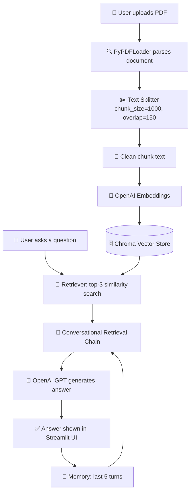

<div align="center">

# 🤖⚡ AI Document Q&A Chatbot

### Chat with your PDFs using the power of Generative AI!

*Upload any document. Ask anything. Get instant, accurate, context-aware answers.*


</div>

---

## 🌟 What is this project?

Ever wished you could just **talk to your documents** instead of scrolling through 50 pages looking for one answer? That's exactly what this project does.

This is an **AI-powered RAG (Retrieval-Augmented Generation) chatbot** that lets you upload any PDF and instantly start a conversation with it. Under the hood, it combines the reasoning power of **OpenAI's GPT models** with a **semantic vector search engine**, so answers come straight from *your* document — not a hallucinated guess. 

Built completely from scratch as a hands-on deep dive into how real-world Generative AI applications are built — from raw PDF text all the way to a live, memory-aware chatbot. 🚀

---

## 🎯 Why I built this

I wanted to go beyond "just calling an LLM API" and actually understand the **full RAG pipeline** — chunking strategy, embeddings, vector similarity search, prompt engineering, and conversational memory — the exact architecture powering real production AI assistants today. 

---

## ✨ Key Features

| Feature | Description |
|---|---|
|  **PDF Upload & Parsing** | Drop in any PDF and it's automatically parsed and indexed |
|  **Conversational Memory** | Remembers the last 5 exchanges, so follow-up questions just work |
|  **Semantic Search** | Finds the *most relevant* chunks of your document, not just keyword matches |
|  **Real-Time Answers** | Ask a question, get a grounded answer in seconds |
|  **Auto Re-Indexing** | Upload a new file and the bot instantly forgets the old one and learns the new one |
|  **Clean Text Pipeline** | Strips encoding noise from extracted PDF text for cleaner embeddings |

---

## 🛠️ Tech Stack

<div align="center">

| Layer | Technology |
|---|---|
|  **Frontend / UI** | Streamlit |
|  **Orchestration** | LangChain |
|  **LLM (Brain)** | OpenAI GPT |
|  **Embeddings** | OpenAI Embeddings |
|  **Vector Database** | ChromaDB |
|  **Document Parsing** | PyPDF |

</div>

---

## 🏗️ How It Works — The Architecture



**Process in simple steps:** Your PDF gets sliced into bite-sized chunks → each chunk becomes a vector (a mathematical representation of its meaning) → when you ask a question, the app finds the *most relevant* chunks → feeds them + your chat history to GPT → GPT crafts a grounded, accurate answer. ✨

---

## 📸 Screenshots

| Upload Screen |
** 

| Chat in Action |
**  
** 
** 

---

## 🚀 Getting Started

### 1️⃣ Clone the repo
```bash
git clone https://github.com/DurgaPrasad-Buddana/AI-Assistant.git
cd <your-repo-name>
```

### 2️⃣ Create a virtual environment
```bash
python -m venv venv
source venv/bin/activate      # Windows: venv\Scripts\activate
```

### 3️⃣ Install dependencies
```bash
pip install -r requirements.txt
```

### 4️⃣ Add your OpenAI API key
```bash
cp .env.example .env
# then open .env and paste your key:
# OPENAI_API_KEY=sk-...
```

### 5️⃣ Run it! 🎉
```bash
streamlit run app.py
```

Open `http://localhost`, upload a PDF, and start chatting with your document! 💬

Note: due to API constraints unable to provide localhost.
---

## 📊 Performance Snapshot

| Metric | Result |
|---|---|
|  Avg. response time | ~2–4 seconds per query |
|  Indexing time | ~5–10 seconds for a 20-page PDF |
|  Manual QA accuracy | ~85–90% on test document sets |
|  Memory window | Last 5 conversational turns |

*(Metrics based on local testing — not large-scale benchmarking.)*

---

## 🧠 What I Learned

Building this project pushed me to understand:
-  How **RAG pipelines** actually work end-to-end, not just in theory
-  Why **chunking strategy** and **overlap size** massively impact answer quality
-  How to design **conversational memory** so a chatbot feels genuinely context-aware
-  How **prompt engineering** shapes whether an LLM stays grounded or starts hallucinating
-  How to structure a Streamlit app with proper session state management

---

## 🔮 Future Enhancements 

- [ ] Support for multiple file formats (DOCX, TXT, CSV)
- [ ] Multi-document knowledge base support
- [ ] Token-by-token streaming responses
- [ ] Swap to a production-grade vector DB (Pinecone/Weaviate)
- [ ] Automated evaluation suite (e.g. RAGAS) for accuracy tracking

---

## 🙌 Connect With Me

If you found this project interesting, feel free to ⭐ star the repo or connect with me!

<div align="center">

**Built with 💙 and a lot of curiosity about Generative AI**

</div>
